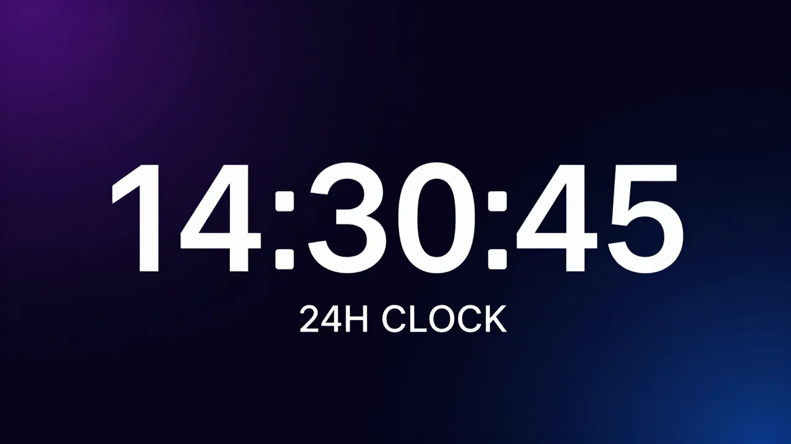

# 🕐 24H Clock Plugin for Agent Zero



A lightweight Agent Zero plugin that forces the WebUI header clock to display time in **24-hour format** (e.g. `14:35:07`) instead of the default 12-hour AM/PM format.

## Features

- ✅ **Toggle ON/OFF** — use the plugin switch in the Plugin Hub to enable or disable at any time
- ✅ **Update-proof** — lives in `usr/plugins/`, survives A0 system updates
- ✅ **Zero config** — works out of the box, no settings to tweak
- ✅ **Persistent** — survives UI reloads via the `initFw_end` lifecycle hook
- ✅ **Non-destructive** — uses MutationObserver, doesn't modify core files

## How It Works

1. Registers a JS module extension at the `initFw_end` hook point
2. Waits for the `#time-date` DOM element to appear
3. Attaches a **MutationObserver** that intercepts every 12h time write
4. Immediately overwrites with clean 24-hour format: `HH:MM:SS`

The date display is preserved unchanged.

## ⚠️ Important: Reload Required

After installing, enabling, or disabling this plugin, you **must reload the page** for the change to take effect:

> **Hard reload the page:** `Ctrl + Shift + R` (Windows/Linux) or `Cmd + Shift + R` (Mac)

If the clock still shows 12-hour format after a hard reload, **restart Agent Zero** (the backend caches plugin state at startup).

## Installation

### From Plugin Hub
1. Open the **Plugins** dialog in Agent Zero
2. Go to the **Browse** tab or click **Install**
3. Search for **24H Clock** and click **Install**
4. **Hard reload** the page (`Ctrl + Shift + R`)

### Manual
1. Clone this repo into your Agent Zero plugins directory:
   ```bash
   git clone https://github.com/jphermans/a0-plugin-clock-24h.git /path/to/agent-zero/usr/plugins/clock_24h
   ```
2. **Restart** Agent Zero
3. **Hard reload** the WebUI (`Ctrl + Shift + R`)

## Toggle ON/OFF

Use the **ON/OFF switch** in the Plugin Hub plugin list:
- **ON** → Time displays in 24-hour format
- **OFF** → Time reverts to the default 12-hour AM/PM format

> Remember to **hard reload** the page after toggling!

## Uninstallation

Remove the plugin folder, restart, and reload:
```bash
rm -rf /path/to/agent-zero/usr/plugins/clock_24h
```

## File Structure

```
clock_24h/
├── plugin.yaml                              # Plugin manifest
├── icon.png                                  # Source icon
├── README.md                                 # This file
├── LICENSE                                   # MIT License
├── webui/
│   └── thumbnail.png                         # Plugin Hub thumbnail
├── docs/
│   ├── banner.png                            # Banner image
│   └── thumbnail.jpg                         # Legacy thumbnail
└── extensions/
    └── webui/
        └── initFw_end/
            └── clock-24h.js                  # 24H clock override (ES module)
```

## Compatibility

- Agent Zero v1.0+
- All modern browsers (Chrome, Firefox, Safari, Edge)

## License

[MIT](LICENSE)
