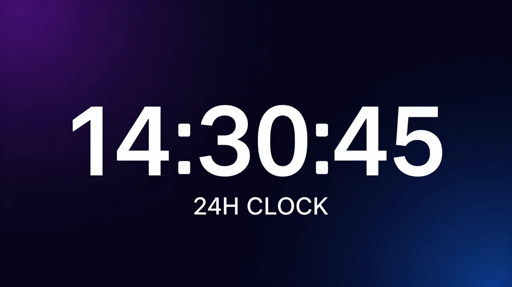

# 🕐 24H Clock Plugin for Agent Zero



A lightweight Agent Zero plugin that forces the WebUI header clock to display time in **24-hour format** (e.g. `14:35:07`) instead of the default 12-hour AM/PM format.

## Features

- ✅ **Always-on** — uses `always_enabled: true` so no manual activation needed
- ✅ **Update-proof** — lives in `usr/plugins/`, survives A0 system updates
- ✅ **Zero config** — works out of the box, no settings to tweak
- ✅ **Persistent** — survives UI reloads via the `initFw_end` lifecycle hook
- ✅ **Non-destructive** — uses MutationObserver, doesn't modify core files

## How It Works

1. Registers a JS module extension at the `initFw_end` hook point
2. Waits for the `#time-date` DOM element to appear
3. Attaches a **MutationObserver** that intercepts every 12h time write
4. Immediately overwrites with clean 24-hour format: `HH:MM:SS`

The date display is preserved unchanged.

## Installation

### From Plugin Hub
*Coming soon*

### Manual
1. Clone this repo into your Agent Zero plugins directory:
   ```bash
   git clone https://github.com/jphermans/a0-plugin-clock-24h.git /path/to/agent-zero/usr/plugins/clock_24h
   ```
2. **Hard reload** the Agent Zero WebUI (`Ctrl+Shift+R`)

## Uninstallation

Remove the plugin folder and reload:
```bash
rm -rf /path/to/agent-zero/usr/plugins/clock_24h
```

## File Structure

```
clock_24h/
├── plugin.yaml                              # Plugin manifest (always_enabled)
├── README.md                                 # This file
├── LICENSE                                   # MIT License
├── docs/
│   └── banner.webp                           # Banner image
└── extensions/
    └── webui/
        └── initFw_end/
            └── clock-24h.js                  # 24H clock override (ES module)
```

## Compatibility

- Agent Zero v0.7+
- All modern browsers (Chrome, Firefox, Safari, Edge)

## License

[MIT](LICENSE)
